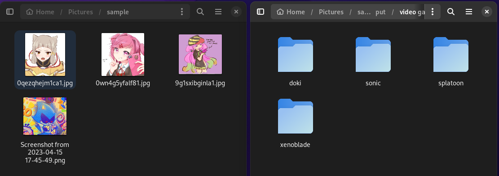
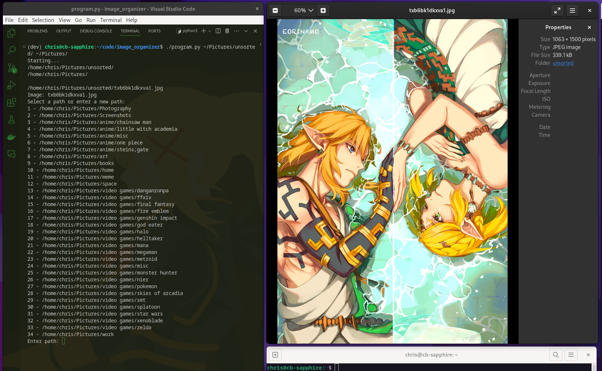

# Image Sorting Program

## Overview

This Python program is designed to help you organize a directory of images by moving them into subdirectories of your choice. The program reads image files from an input directory and allows you to select or enter a destination path for each image. It will then move the images accordingly.



## Sample run:

Type an existing known path and auto-match:
```bash
/home/chris/Pictures/unsorted/Screenshot 2021-12-06 083356.png
Image: Screenshot 2021-12-06 083356.png
Select (or type new): ffxiv
/home/chris/Pictures/video games/ffxiv
```

New path detection and add:
```bash
/home/chris/Pictures/unsorted/1615334503884.png
Image: 1615334503884.png
Select (or type new): video games/sonic
Path is new
Use /home/chris/Pictures/video games/sonic (y/n)?y
/home/chris/Pictures/unsorted/Screenshot 2022-03-10 095647.png
```

If printing all paths and using numbers:
```bash
Image: 0wn4g5yfalf81.jpg
Select a path or enter a new path:
1 - /home/chris/Pictures/video games/doki
2 - /home/chris/Pictures/video games/sonic
3 - /home/chris/Pictures/video games/splatoon
4 - /home/chris/Pictures/video games/xenoblade
Select (or type new): 1
```



## Requirements

- Python 3.x
- Input and output directories for image organization

## Usage

To use this program, follow these steps:

1. Open a terminal window.

2. Run the program using the following command:

   ```bash
   python program.py <input_directory> <output_directory>
   ```

## multiple usage detection

if multiple paths are find, the program will auto-accept any path that endwith the user endpoint

```bash
 /home/chris/Pictures/unsorted/tpvqi0up1e461.png
Select (or type new): fantasy
/home/chris/Pictures/fantasy
/home/chris/Pictures/video games/final fantasy
Multiple paths exists, but using endswith: /home/chris/Pictures/fantasy
```

Replace <input_directory> with the path to the directory containing your images.
Replace <output_directory> with the path to the directory where you want the organized images to be placed.

The program will display the images in the input directory one by one and prompt you to select or enter a destination path for each image.

You can select a previously used path by entering the corresponding number, or you can enter a new path. The program will create subdirectories as needed.

After processing all the images, the program will display the prior paths you've used.

The program also stores your user-modified paths in a file named user_modified_paths.txt for future reference.
    
# Note

This program assumes that the input images are in the following formats: .jpg, .jpeg, .png, or .gif. Images in other formats will be ignored.

Make sure to have a text file named user_modified_paths.txt in the same directory as the program to store and read the user-modified paths.

Please ensure that you have appropriate permissions to read from the input directory and write to the output directory.

Caution: Moving and organizing files using this program will result in files being moved to the selected output directory, and existing files with the same names may be overwritten. Use with caution.

# Usage

Feel free to modify and enhance this program to suit your specific needs. Enjoy organizing your images with ease!